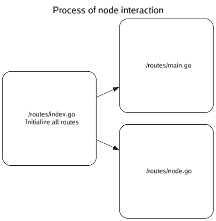

# go_graph_code_docs
Utility for generating an image graph for code documentation, helps to better depict the process of interaction of the business logic of one file with another file
Output: .gv, .png, .svg

## Quick start

### Usage reference

```go
package your_package

import (
	// import library
	"github.com/DaksinWorld/go_graph_code_docs"
	"github.com/DaksinWorld/go_graph_code_docs/themes"
)

func main() {
	// Specify path to folder to be parsed | name of output directory | name of file with graph
	parser := docParser.Parse("./app", "output", "graph")

	// Add title to graph, which will be generated if necessary
	parser.AddTitle("Process of node interaction")

	// Enable theme if required
	parser.AddTheme(themes.LightTheme)

	// Generate output
	parser.Generate()
}
```

### Syntax
We specified root folder as `./app`

In `./app` folder we have `./routes/` folder

In `./routes/` folder we have `./routes/index.go` file and `./routes/main.go`, `./routes/node.go`

```go
./routes/index.go

package routes

// Because our root folder is ./app, @ in @/routes/index.go is ./app,
// So it will replace @ on ./app, in result we will have ./app/routes/index.go,
// Which is basically path from main.go file to index.go
// So we always add prefix DOC# and @ as source node,
// Then we provide path as describe above to node using -> 

// DOC# @ -> @/routes/node.go 
// DOC# @ -> @/routes/main.go

// We use DOC## to specify attributes, Name of object (could be Node or Edge) and property, for example: height: 3
// List of attributes is available describe below

// DOC## Node = height: 3
// DOC## Edge = color: red

func InitRoutes(){
    ...
}
```

### Attributes
List of available attributes is available [here](https://graphviz.org/doc/info/attrs.html)

### Custom attributes:

**Only for Nodes!**:

```// DOC## Node = Description: Initialize all routes```

So in result we have:


